# Screenshots

Visual overview of the SuluTailwindThemeBundle admin interface.

---

## Theme list

The **Settings > Themes** page displays all created themes. You can activate, edit, or delete themes from here.

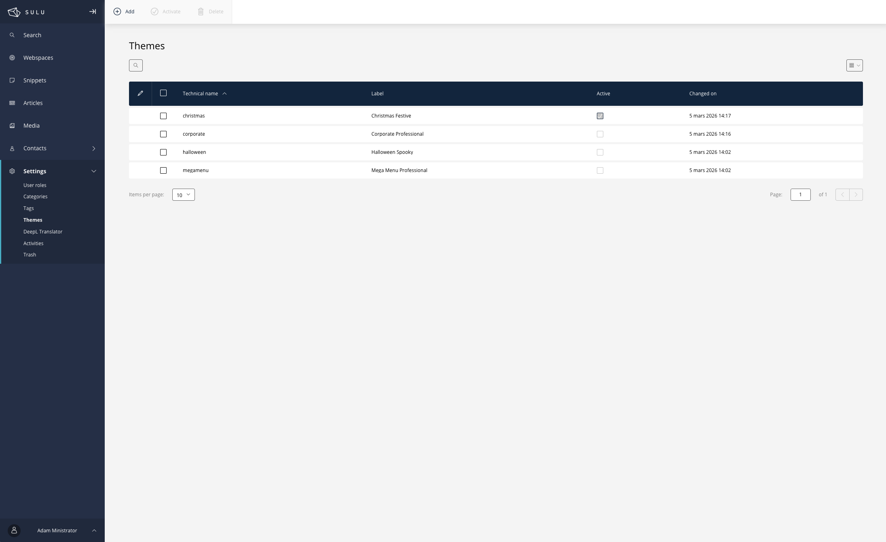

---

## Colors tab

Define the **main colors** of your theme: primary, secondary, accent, and background. Text colors (text, link, link hover) are configured separately.

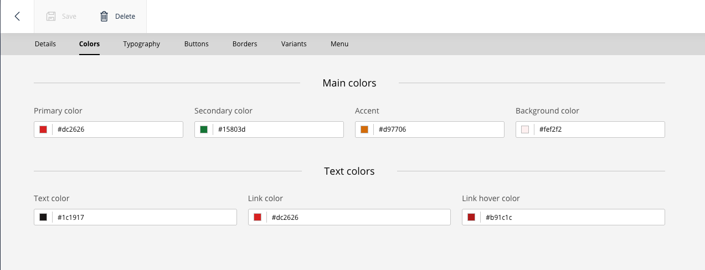

### Auto-generated color palette

When you define a main color (primary, secondary, accent, or background), the bundle **automatically generates a full palette of 11 shades** using the OKLCH color space — from `50` (lightest) to `950` (darkest), just like Tailwind CSS.

This means you only need to pick **one color**, and the entire palette is computed for you. Each shade is available as a CSS custom property (e.g., `--color-primary-50`, `--color-primary-100`, ..., `--color-primary-950`).

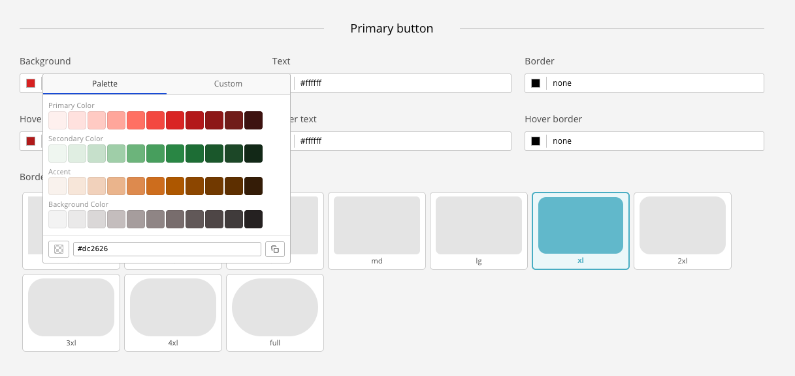

> See [CSS Variables Reference](css-variables.md#color-palettes-oklch) for the full list of generated shade variables.

---

## Typography tab

Select font families for **heading**, **body**, and **accent** roles via the Font Picker. For each role, configure the font weight, size, style, and line height. The Font Picker supports Google Fonts (with autocomplete), system fonts, and free text input.

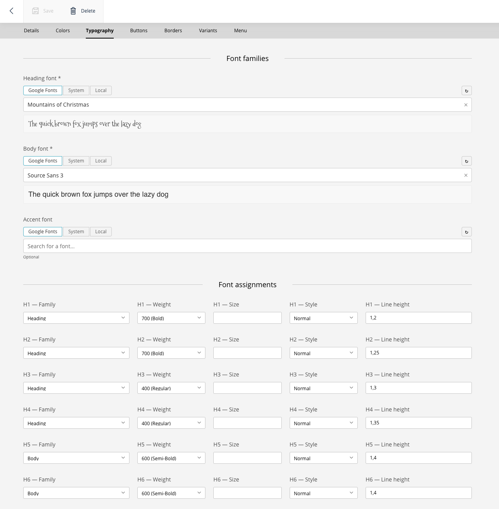

---

## Buttons tab

Configure **primary**, **secondary**, and **accent** button styles. For each variant, set the background, text color, border, hover states, and border radius.

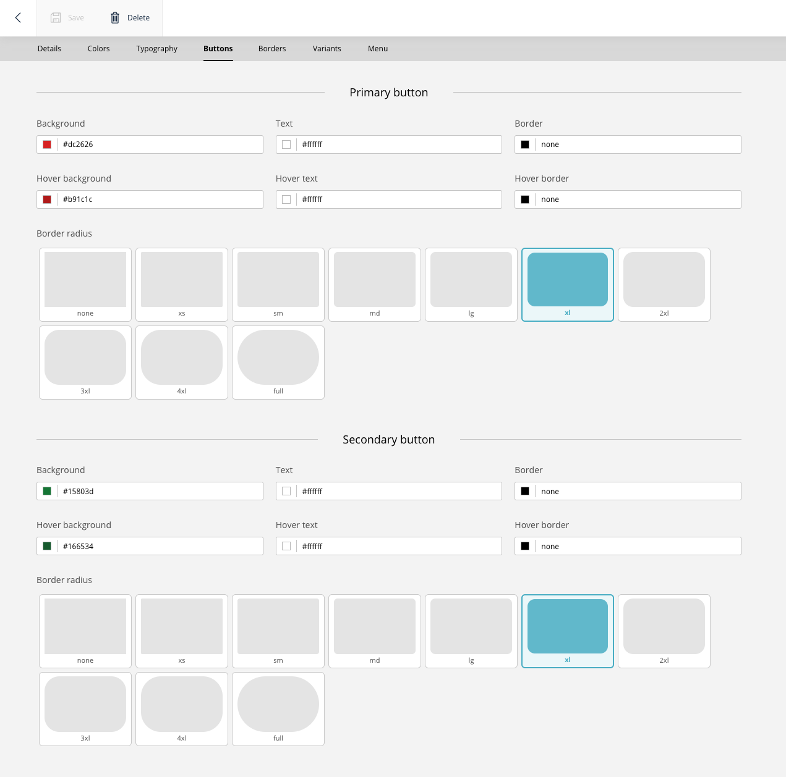

---

## Borders tab

Set global border radius values: default, small, large, full, and image radius.

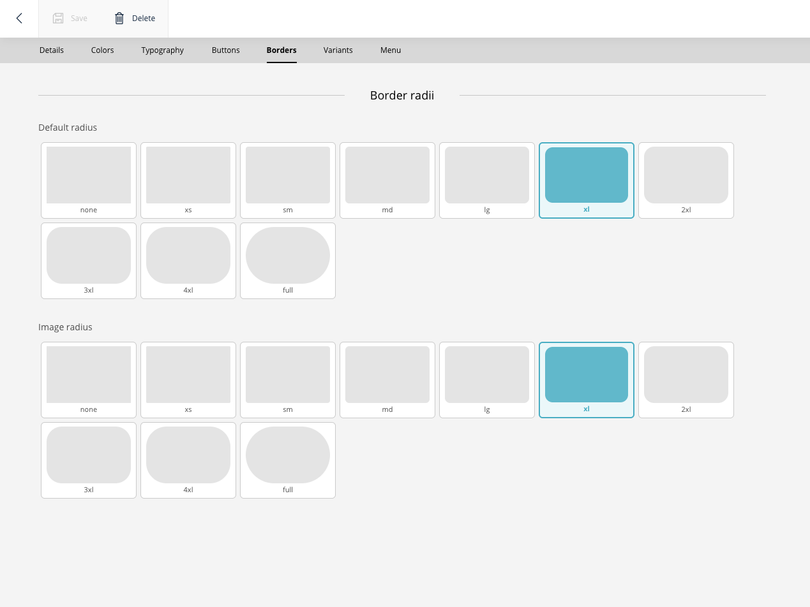

---

## Block variants tab

Define **color schemes** for content blocks (e.g., light, accent, dark). Each variant controls heading color, paragraph color, link color, background color, button style, and more. Variants are applied to blocks via the `.block-variant-{index}` CSS class.

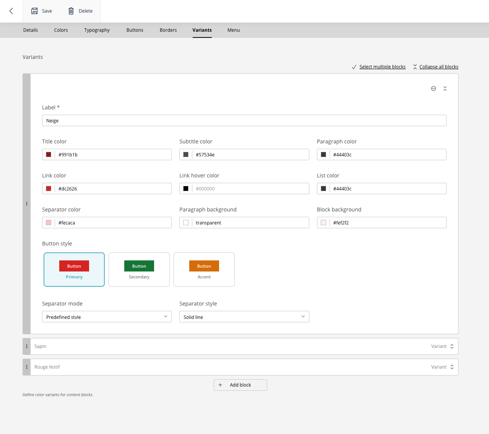

> See [Block Variants](block-variants.md) for the full reference.

---

## Menu tab

Choose the **menu type** (navbar, burger, fullscreen, sidebar, megamenu), configure colors, animation, logo, and display options for desktop and mobile.

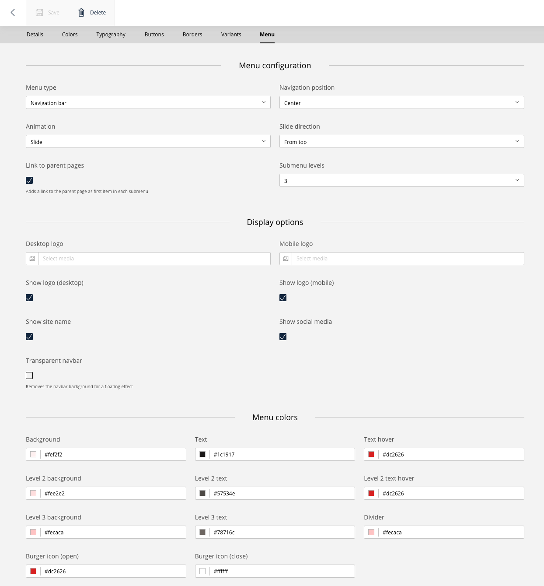

---

## Block editing

Each block in a page has **3 collapsible sections**: Content, Appearance, and Settings.

### Sections overview

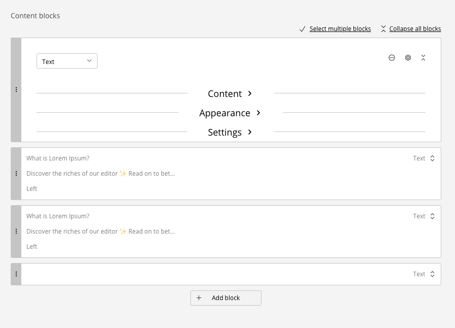

### Appearance section

Select a **color variant** and an optional **layout style** for the block.

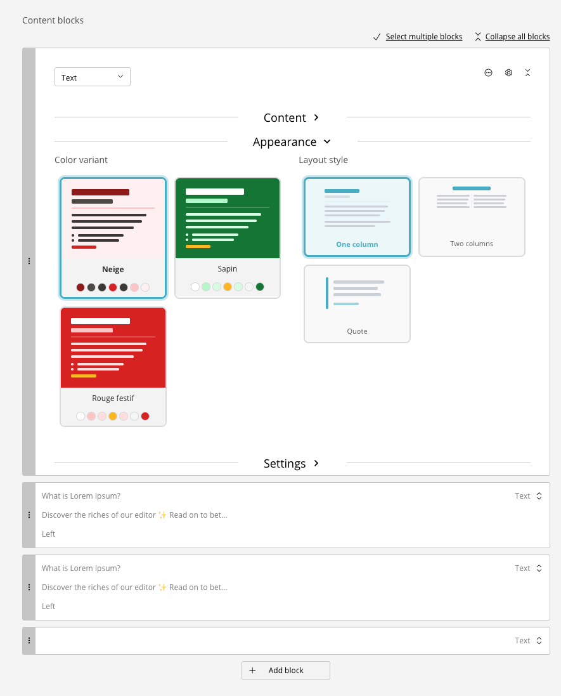

### Settings section

Fine-tune **margins**, **paddings**, **border radius**, **lateral margins mode**, and **background visibility** per block.

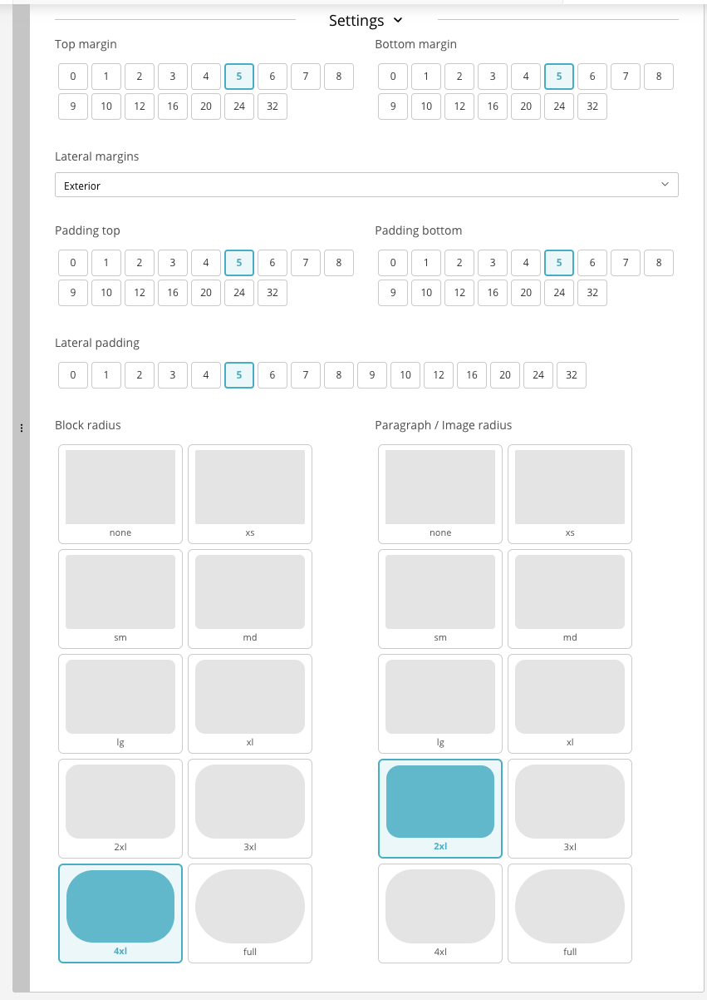
